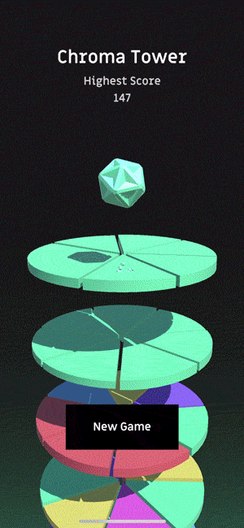

# Chroma Tower
A hyper-casual mobile game exercise, heavily influenced by Voodoo's "Helix Jump"



I recently had a job interview, where I was asked to pick at least two popular hyper-casual games and create a mash-up within 3 days. A weekend project in a way.

So I decided to combine Helix Jump with color matching mechanics and this came out.
I think it turned out to be a little too nice of a pet project to be swept aside after the process is over.
And it is not exactly an original idea, so I decided to put it out there as an open-source exercise.

## Gameplay
In order to score, you have to match the color of the ball with a matching platform slice.

Each time you hit a correct slice, the score is incremented by the combo at the time. Also, you get a tiny bit of a regeneration boost along the way.

When your health is too low, the upcoming platforms turn to single color to help the player out a bit.

That's it!

## Structure
The code is divided into three major namespaces, namely the Engine, the View and the UI.

The bootstrapper component combines the three scopes, where the Engine provides the behaviour,
the Renderer provides the user input management and Unity related systems such as physics
and the UI is, well, the UI.

Most communication is handled through callbacks, where any object that requires to act in a certain way at a specific state of the game, can subscribe to the corresponding callback.

The available actions that I implemented and use are

```csharp
public event Action OnGameOver;
public event Action OnNewGame;
public event Action OnDamage;
public event Action OnSuccessfulHit;
public event Action OnHit;
```

Most of the behaviour is defined as either an abstract class or an interface, such as the PlayerHealth, GameDifficulty or the ColorServer, so go ahead and change stuff.

For instance, the Difficulty class doesn't know the game is a color based puzzle. It just serves the next slot to be targeted, whatever shape or form that may have.

And the ColorServerOrderedHue class creates a color, by using the slot index as the hue. ColorServerOrderedHue implements the abstract class AColorServer, which has the following abstract functions.

```csharp
abstract public Color MakeColor();
abstract public Color GetColor(int index, int range);
abstract public Color LastColor();
```

You could create a completely coloring system by implementing a new concrete class deriving from AColorServer.

The available interface and abstract classes are

```charp
abstract class AColorServer: MonoBehaviour
public interface IDifficulty
public interface IPlayerHealth
public interface IPlayerState
public interface IScoreKeeper
```

## Where to go
This little project kind of grown on me, so I might keep on adding new features such as power-ups and so on. Maybe someday it may even graduate to being its own original game.
